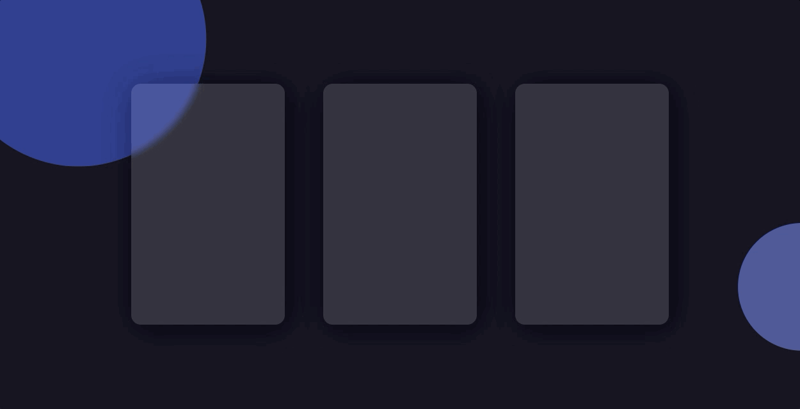

## Floating Card Animation

### CSS实现悬浮卡片动画

<div>
    <p align="center">
        
    </p>
</div>

### 实现过程中，需要记忆的点

#### 毛玻璃效果

`backdrop-filter: blur(5px);` 这个 CSS 属性用于在元素的背景上应用一个模糊效果。具体来说，它会对元素背后的内容进行模糊处理，而不是元素本身。

`backdrop-filter`：该属性允许你对元素背后的区域应用图形效果，比如模糊、亮度调整、对比度、灰度等。常用于创建模糊背景的效果。

`blur(5px)`：这是 `backdrop-filter` 的一个效果，表示应用一个 5 像素的模糊效果。模糊效果会使元素后面的背景区域变得模糊，产生类似玻璃效果的效果。

```css
div {
	backdrop-filter: blur(5px); /* 毛玻璃效果 */
}
```

---

#### 鼠标事件

`pointer-events: none;` 这个 CSS 属性用于控制元素是否可以成为鼠标事件的目标。设置为 `none` 后，元素将无法接收到任何鼠标事件，如点击、悬停、拖拽等。

##### 作用：

`pointer-events: none;` 会使元素变得“透明”于鼠标事件，意思是鼠标事件（例如点击、悬停、拖动）将被“穿透”到该元素下面的其他元素上。即使该元素在视觉上存在，它也不会干扰其他元素的交互。

```css
.element {
  pointer-events: none;
}
```

设置了 `pointer-events: none;` 的 `.element` 元素将不再响应鼠标事件。即使你点击了它，事件也会被传递给它下面的元素。你仍然可以看到 `.element` 元素，但它不会影响鼠标交互。

##### 适用场景：

- 禁用某个元素的交互：比如你可能希望暂时禁用按钮、链接或其他交互元素的响应，但仍然希望它们显示在页面上。使用 `pointer-events: none;` 可以有效禁用鼠标事件。
- 创建不可点击的覆盖层：有时在设计中，你可能需要在页面上放置一个元素作为视觉效果或装饰，但不希望它阻止用户与下面的内容进行交互。使用 `pointer-events: none;` 可以让这个元素“透明”于鼠标事件。

---

#### 圆形的裁剪区域

`clip-path: circle(20% at 10% 10%);` 这段 CSS 用于为元素创建一个圆形的裁剪区域。下面是详细解释：

- `circle(20%)`：这定义了一个圆形作为裁剪路径。`20%` 是圆的半径，表示圆的大小为元素宽度或高度的 20%（取较小的值）。圆的半径大小是相对于元素的尺寸来计算的。
- `at 10% 10%`：这定义了圆心的位置。`10% 10%` 表示圆心位于元素宽度的 10% 和高度的 10% 的位置，也就是元素的左上角。这样，圆形的中心点会偏向元素的左上角。

若是想在右侧，可以写`at right 70%`，表示右侧距离顶部70%的位置。
