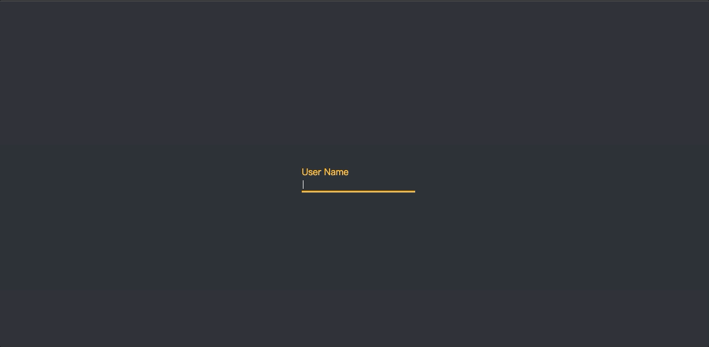

## Material Input

### CSS实现Material Input效果

<div>
    <p align="center">
        
    </p>
</div>

### 实现过程中，需要记忆的点

#### 考虑元素层级

除了背景外，层级应该是：

* `bar`：应在上层
* `input`：应在中间层
* `label`：应在底层

这里需要注意的是`input`和`label`的层级，若`label`比`input`高时，会导致在鼠标移入输入框时，`label`会挡住`input`，此处我选择将`input`的background-color设置为透明，以达到最终效果。

#### 使用required属性

由于我们最终希望，当输入内有内容时，`label`不再回弹，`bar`不再缩回，所以我们使用`<input>`的*reuqire*属性来判断是否有内容。

CSS使用`:valid`伪类，来实现最终的效果

```css
/* 控制输入框内有内容时，Label不再下移 */
.input-container input:valid ~ label,
.input-container input:focus ~ label {
    transform: translateY(-20px);
    color: #FAC145;
    font-size: 16px;
}

/* 控制输入框内有内容时，bar不再收缩 */
.input-container input:valid ~ .bar,
.input-container input:focus ~ .bar {
    width: 100%;
}
```


