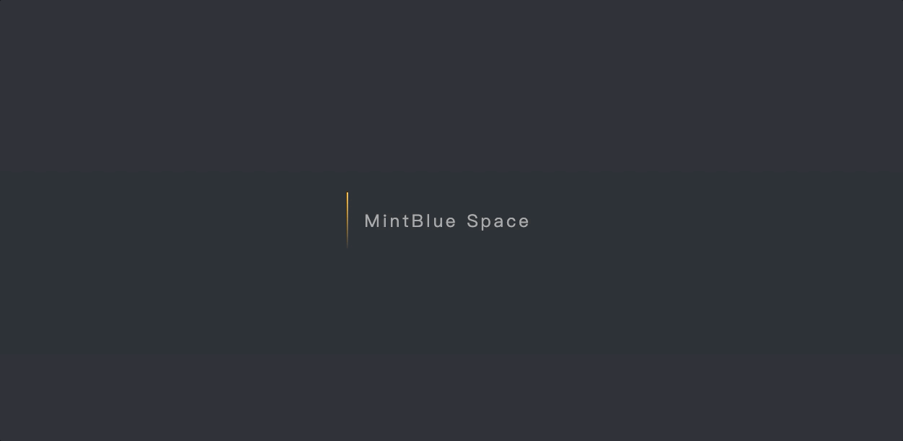

    

        
    

---
#### Explore and practice creative CSS animations

### Floating Card Animation

    

        
    

[🚀 Floating Card Animation](https://github.com/DDDDanny/Animatrix/tree/master/FloatingCard)

---

### Loading Bar

    

        
    

[🚀 Loading Bar](https://github.com/DDDDanny/Animatrix/tree/master/LoadingBar)

---

### Material Input

    

        
    

[🚀 Material Input](https://github.com/DDDDanny/Animatrix/tree/master/MaterialInput)

---

### Science Fiction Lamp

    

        
    

[🚀 Science Fiction Lamp](https://github.com/DDDDanny/Animatrix/tree/master/ScienceFictionLamp)

---

### Sliding Selector

    

        
    

[🚀 SlidingSelector](https://github.com/DDDDanny/Animatrix/tree/master/SlidingSelector)

---

### Static Skill Bar

    

        
    

[🚀 Static Skill Bar](https://github.com/DDDDanny/Animatrix/tree/master/StaticSkillBar)