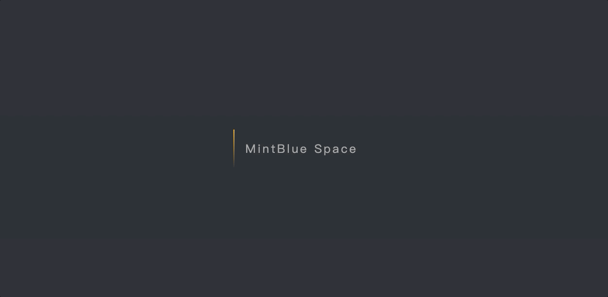
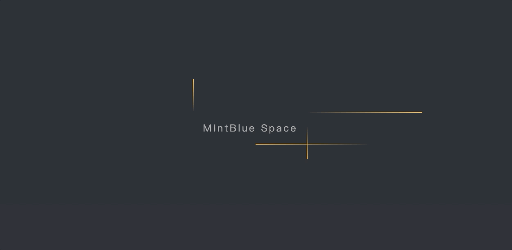

## Science Fiction Lamp

### CSS实现科幻灯特效

<div>
    <p align="center">
        
    </p>
</div>

### 实现过程中，需要记忆的点

#### 如何实现

1. hover后，霓虹灯效果是由多层阴影实现
2. 运动光束实现，看似是围着边框移动，实则是4个方向分别有个细线条直线运动，通过控制他的运动间隔时间，从而实现每个边的线按照顺时针的顺序移动

<div>
    <p align="center">
        
    </p>
</div>
3. 隐藏多余的光束轨迹：使用`overflow: hidden`

#### 制作发光效果

使用多重阴影

```css
.neon-button:hover {
    background-color: #FAC145;
    color: #FFF;
    cursor: pointer;
    box-shadow: 0 0 5px #FAC145,
                0 0 25px #FAC145,
                0 0 50px #FAC145,
                0 0 100px #FAC145;
}
```

#### 调整色调

如果想调整整体的颜色，可以选择每个颜色属性去修改，但是会涉及到很多，不够方便。可以选择一个快速修改的方法，直接使用`filter:hue-rotate(xxdeg)`，`hue-rotate`是色相旋转，可以在顶部盒子中使用，改变色调。


### 特别鸣谢

[StarAndroid](https://juejin.cn/user/1258265331121399/posts)