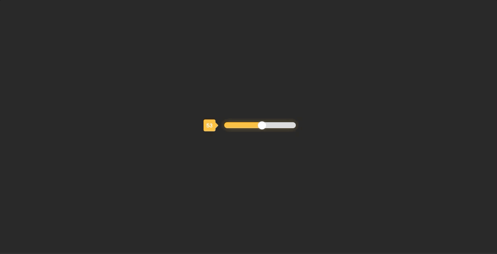

## Sliding Selector

### CSS实现滑动选择器

<div>
    <p align="center">
        
    </p>
</div>

### 实现过程中，需要记忆的点

### 文本上下居中

若文本想要在`<span>`标签中上下居中，可以把文本的行高设置为`<span>`相同高度，以达到最终效果

```css
#sliding_value {
  	...
    height: 30px;
    line-height: 30px; /* 容器的高度等于容器的高度 */
  	...
}
```

#### 禁用浏览器默认外观

```css
/* 禁用浏览器默认外观 */
-webkit-appearance: none;
```

#### 重写滑动Selector

```css
input[type='range'] {
    /* 禁用浏览器默认外观 */
    -webkit-appearance: none;
    width: 180px;
    height: 15px;
    border-radius: 8px;
  	/* 滑动条的背景颜色：#FAC145和#dcdcdc两个背景层 */
    background: -webkit-linear-gradient(#FAC145, #FAC145) no-repeat, #dcdcdc;
    outline: none;
    box-shadow: 0 0 15px #FAC14550;
}

/* 滑块样式 */
input[type='range']::-webkit-slider-thumb {
    -webkit-appearance: none;
    width: 20px;
    height: 20px;
    border-radius: 50%;
    background-color: white;
}

input[type='range']::-webkit-slider-thumb:hover {
    cursor: pointer;
}

input[type='range']:active::-webkit-slider-thumb {
    background-color: #fff;
    box-shadow: 0 0 5px #ffffff50;
}
```

#### 响应式对象

```js
<script>
      // Method 1：
      // const sliderEl = document.getElementById('sliding')
      // sliderEl.style.backgroundSize = `${(sliderEl.value / sliderEl.max) * 100}% 100%`
      // const sliderValue = document.getElementById('sliding_value')
      // sliderEl.addEventListener("input", () => {
      //   sliderValue.innerText = sliderEl.value
      //   sliderEl.style.backgroundSize = `${(sliderEl.value / sliderEl.max) * 100}% 100%`
      // })

      // Method 2:
      const sliderEl = document.getElementById('sliding')
      const sliderValue = document.getElementById('sliding_value')

      // 创建一个响应式对象
      const sliderState = new Proxy({
        value: sliderEl.value,
        backgroundSize: `${(sliderEl.value / sliderEl.max) * 100}% 100%`
      }, {
        set(target, prop, newValue) {
          target[prop] = newValue
          if (prop === 'value') {
            sliderEl.value = newValue
            sliderEl.style.backgroundSize = `${(newValue / sliderEl.max) * 100}% 100%`
            sliderValue.innerText = newValue
          }
          return true
        },
      })
      // 初始化时设置背景大小
      sliderEl.style.backgroundSize = sliderState.backgroundSize
      // 监听输入事件，更新响应式状态
      sliderEl.addEventListener('input', () => {
        sliderState.value = sliderEl.value
      })
    </script>
```

### 特别鸣谢
[StarAndroid](https://juejin.cn/user/1258265331121399/posts)
