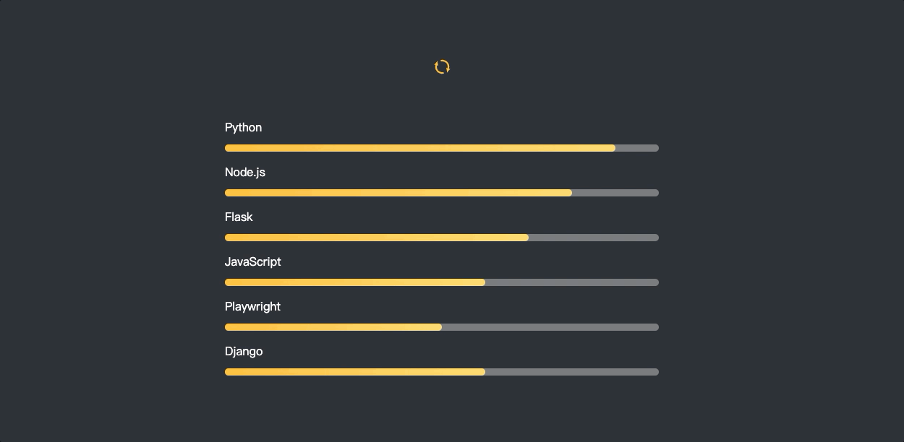

## Static Skill Bar

### CSS样式之静态技能条

<div>
    <p align="center">
        
    </p>
</div>

### 实现过程中，需要记忆的点

#### 技能条底部阴影

可以用`::before`伪元素来写

```css
li::before, li::after {
    content: '';
    display: block; /* 块级元素 */
    width: 100%;
    height: 10px;
    border-radius: 8px;
    position: absolute;
    margin: 15px 0;
    top: 20px;
}
```

#### 刷新转动效果

直接可以用transform写个旋转的效果即可

```css
/* 鼠标移入旋转180度、移出会自动反向旋转 */
.kill-container img {
    width: 23px;
    height: 23px;
    transform: rotate(0deg);
    transition: all 1s ease-in-out;

    &:hover {
        transform: rotate(180deg);
    }
}
```

### 特别鸣谢
[StarAndroid](https://juejin.cn/user/1258265331121399/posts)